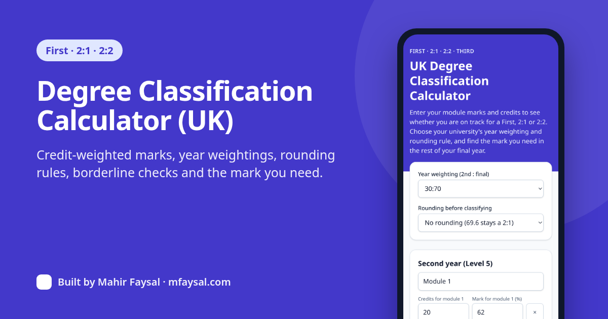
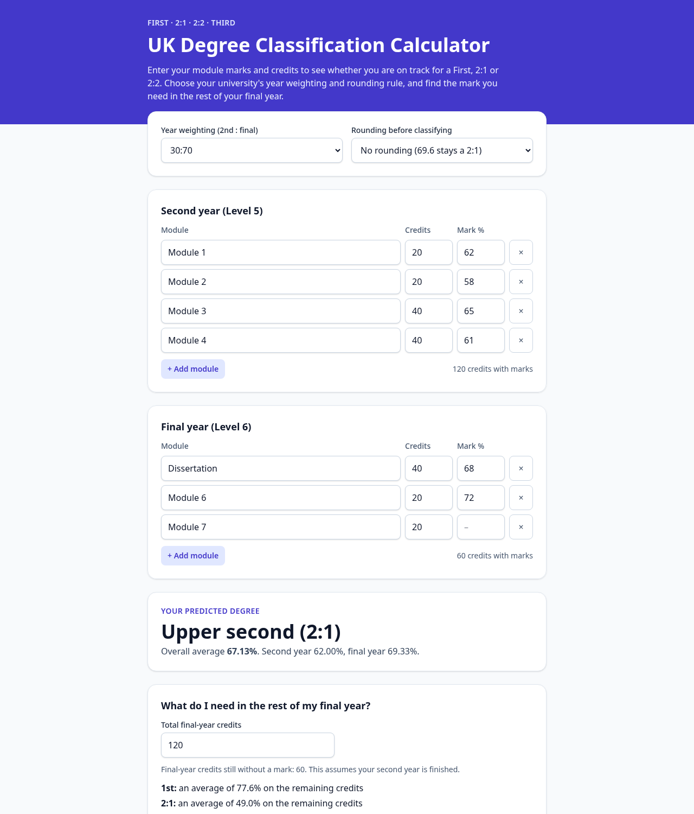
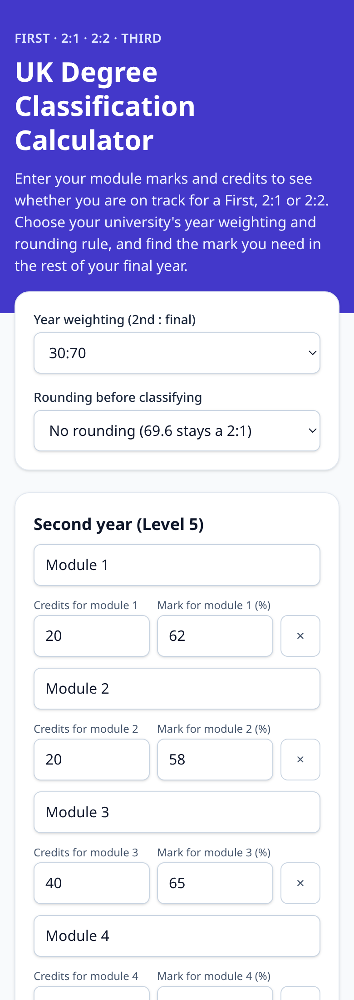

# UK Degree Classification Calculator

Find out whether your marks add up to a **First, 2:1, 2:2 or Third**. Enter your second-year and final-year modules with their credits, pick your university's year weighting and rounding rule, and see your overall average, borderline warnings and the mark you need in the rest of your final year.

**Live:** https://degree-classification-calculator.vercel.app



## Features

- Credit-weighted year averages (a 40-credit dissertation counts twice a 20-credit module).
- Weightings: final year only, 20:80, 25:75, 30:70, 1:2, 40:60, 50:50 or custom.
- Rounding: none, 1 decimal place, or whole marks (69.5 → 70), applied before classifying.
- Borderline flag within 2 marks of the next class.
- "What do I need?" for a First, 2:1 and 2:2 on your remaining final-year credits.
- Marks are saved in your browser (localStorage). Nothing is uploaded and no API keys are used.

| Desktop | Mobile |
| --- | --- |
|  |  |

## Boundaries used

First 70%+ · 2:1 60–69% · 2:2 50–59% · Third 40–49%. Universities set their own weighting, rounding and borderline rules, so check your handbook. The logic is in [`src/lib/degree.ts`](src/lib/degree.ts).

## Stack

Next.js 16 (App Router, static) · TypeScript · Tailwind CSS v4 · Vitest

## Develop

```bash
npm install
npm run dev
npm test
npm run lint
npm run build
```

## Author

Built by [Mahir Faysal](https://mfaysal.com), a student web developer.

- Project page: [Degree Classification Calculator on mfaysal.com](https://mfaysal.com/projects/degree-classification-calculator)
- More projects: [mfaysal.com/projects](https://mfaysal.com/projects) · Blog: [mfaysal.com/blog](https://mfaysal.com/blog)
